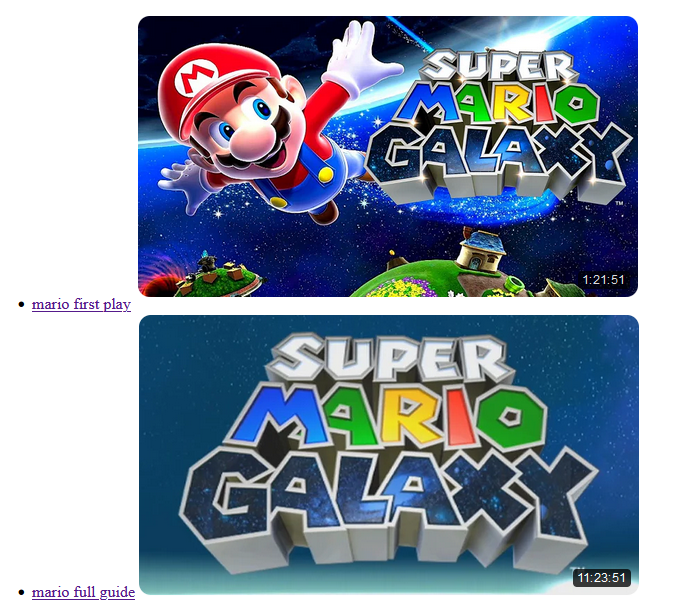

## Models, views en controllers

#### start

- in de volgende files moet je opdrachten uitvoeren:
    - `videocontroller.php`
    - `videolistcontroller.php`
    - `view/videoview.php`

> kijk naar de `???` en los het op!

#### oplossing:

> wat je krijgt als je klaar bent, zijn 2 pagina's 
> de `videolistcontroller.php` linked naar de video display pagina (`videocontroller.php`)
> 
> 